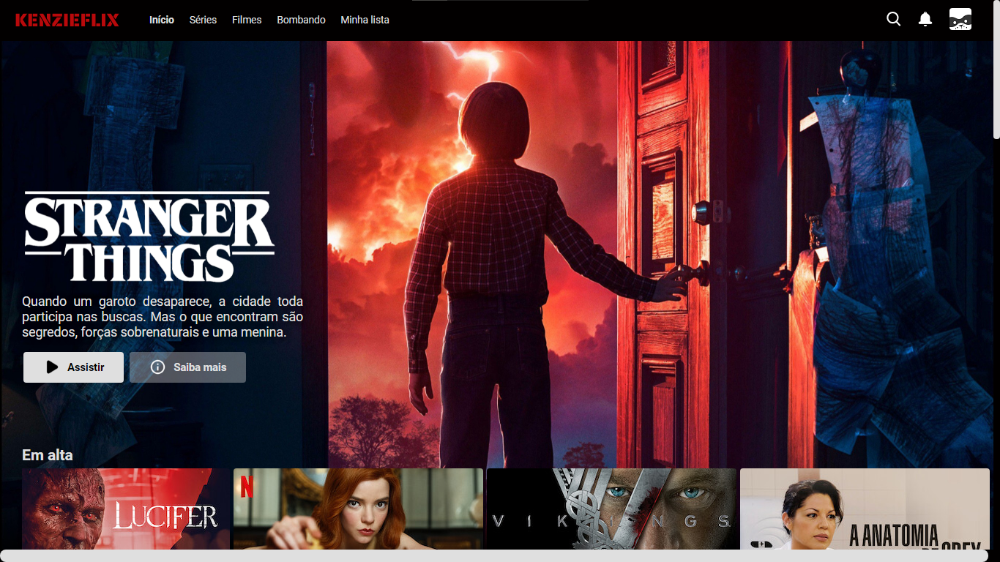
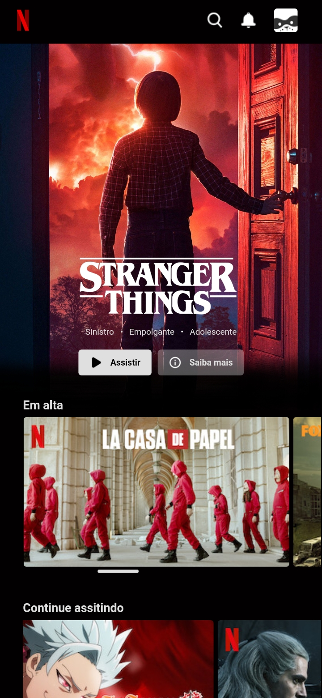

<h1 align="center">🎬 Kenzieflix 🎬</h1>

Uma réplica da página <em>web</em> da Netflix, titulada de Kenzieflix. Desenvolvido por mim a partir da <strong>Maratona de Programação do Zero ao Código 2ª Edição</strong> da Kenzie Academy Brasil. Este projeto tem como finalidade praticar meus estudos de HTML e me introduzir em CSS.

<h4 align="center">Finalizado! 🚀<h4>

## 🛠 Ferramentas

- [Visual Studio Code](https://code.visualstudio.com/)

## 💻 O Projeto

### Estrutura de arquivos

- README.md
- index.html
 - /assets
    - /css
        - style.css
    - /img

## 📷 Imagens da página web
 
 

 
  
Kenzieflix Desktop
  
  
Kenzieflix Mobile

  
 

 
## 🎨 Layout base

- [Kenzieflix Desktop](./assets/img/desktop.png)
- [Kenzieflix Mobile](./assets/img/mobile.png)

### Fonte

- 'Roboto', sans-serif;

### Cores uilizadas

- #020000
- #02000000
- #dfdfdf
- #dfdfdfa4
- #dfdfdf3a
- #dfdfdf5c
- grey
- black
 
 ## Autora

<a href="https://github.com/lucianaTSoares">
     
    Luciana Thomaz Soares ✨
</a>

 Feito com ❤ por Luciana Soares

  

